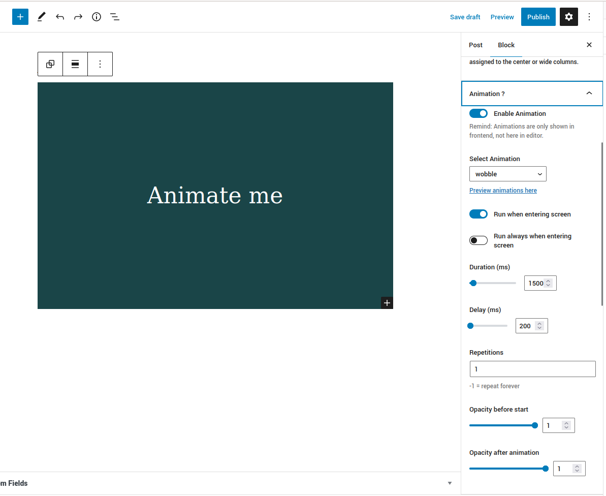
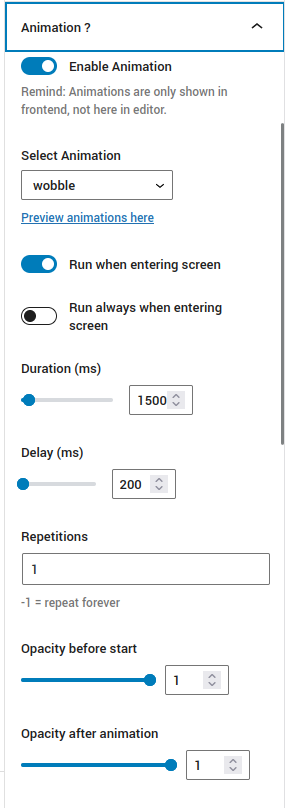

## Animate Core Blocks in Gutenberg Block Editor

Plugin provides an Panel for Gutenberg Inspector which allows you to animate
Core-Blocks. (see screenshots below)

Tested in a WP 6.0
Not sure if this works with all core blocks. But with rather simple ones (like headlines) it should work
no warranty 

It comes with a JS and a CSS File for Frontend.

Animations are only shown in frontend not in the editor.

Ask me if you need the src files
lars@larslo.de

## Credits
Animation from here https://github.com/animate-css/animate.css

## Installation
clone/download this repo. put it into wp-content/plugins and activate it.

## Tags
#gutenberg, #block-editor, #inspector, #CSS-Animation, #wordpress, #wordpress plugin  

## Licence
The code in this project is licensed under GNU GPLv3 (GNU GENERAL PUBLIC LICENSE Version 3).

